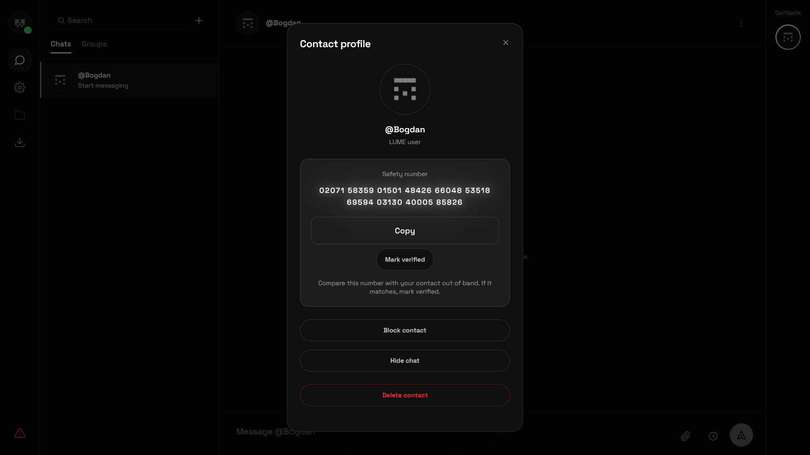

# LUME

**An encrypted messenger with no phone number, no email, and no password.**
Your identity is a key pair. The server is a blind relay: it stores and forwards
opaque encrypted blobs and never sees plaintext, keys, or message content. All
cryptography runs on the client.



[**Open the web app**](https://lume-dev-version.vercel.app) ·
[Android](https://github.com/lumeincc/lume-mobile/releases) ·
[What it does not protect you from](SECURITY.md#what-lume-does-not-protect-you-from)

- **Identity** is an Ed25519 key pair derived from a BIP39 phrase. No phone
  number, no email, no password, no session.
- **Messages** use X3DH key agreement and a Double Ratchet, so every message is
  encrypted under its own key.
- **Keys** never leave the device. They are sealed in IndexedDB under a key
  derived from the user's PIN and held only in a module-scoped vault — never in
  application state. The vault empties itself after fifteen minutes without
  interaction, so an unattended screen is not an open conversation.

## Stack

| | |
|---|---|
| Client | Next.js 16 (App Router) · React 19 · Tailwind · Zustand · TweetNaCl · PWA |
| Server | Express · `ws` · SQLite (`better-sqlite3`) |
| Crypto | X3DH · Double Ratchet · HKDF-SHA256 · XSalsa20-Poly1305 |
| Auth | Ed25519 request signatures |

TypeScript strict throughout.

## Mobile

The native Android client lives in its own repository:
[**lumeincc/lume-mobile**](https://github.com/lumeincc/lume-mobile).

It is a real native app rather than this one in a wrapper, and it does not
reimplement the cryptography — `src/crypto/` there is copied from this repository
byte-identical, and this repository's own crypto tests run inside it unchanged,
so the two cannot drift apart unnoticed.

## How it works

[`docs/PROTOCOL.md`](docs/PROTOCOL.md) is the API reference: endpoints, the
WebSocket protocol, the encrypted payload format, error handling, and the table
of limits.

[`docs/DDOS.md`](docs/DDOS.md) covers abuse and denial of service — what is
enforced in code, what can only be bought at the edge, and the gaps that are
stated rather than glossed.

The cryptography itself is best read in the source, which is short and commented:

| | |
|---|---|
| X3DH and the Double Ratchet | [`client/src/crypto/ratchet.ts`](client/src/crypto/ratchet.ts) |
| Key generation and signing | [`client/src/crypto/keys.ts`](client/src/crypto/keys.ts) |
| Recovery phrase | [`client/src/crypto/mnemonic.ts`](client/src/crypto/mnemonic.ts) |
| Safety numbers | [`client/src/crypto/safetyNumber.ts`](client/src/crypto/safetyNumber.ts) |
| Prekey rotation | [`client/src/crypto/spkRotation.ts`](client/src/crypto/spkRotation.ts) |
| Where keys are held | [`client/src/crypto/keyVault.ts`](client/src/crypto/keyVault.ts) |

## Check the central claim yourself

The server storing nothing readable is the one thing worth verifying rather than
believing. There is a script for it in the mobile repository: it registers two
throwaway accounts on the live relay, sends a real message, reads back what was
stored, and fails if the plaintext is in there.

```bash
git clone https://github.com/lumeincc/lume-mobile
cd lume-mobile && npm install && npm run e2e:message
```

```
WHAT THE RELAY STORED (this is all it ever sees):
  {"v":2,"alg":"lume-ratchet","header":{…},"ciphertext":"…"}
  contains the plaintext? no
```

## Security

[**`SECURITY.md`**](SECURITY.md) is the page to read. It says how to report a
vulnerability privately, what is in scope — and, in plain language, **what LUME
does not protect you from**. Every messenger has that list; most do not publish
it.

The short version of the limits: the relay cannot read your messages, but it can
see who you write to while they are offline, and it knows who is in a group.
Your unlock passphrase is the ceiling on everything stored locally. And a web app
is code served to you on every load, which is a trust assumption no amount of
client-side cryptography removes.

Security review happens as a separate adversarial pass, with its record under
a private repository — findings, evidence, and the ones still open. Nothing signs
off on its own security.

## Licence

LUME is source-available under the [LICENSE](LICENSE).
You may read and reference the source, but running, copying, modifying, or
distributing it requires a separate written licence. This is not an open-source
or free-software licence.

Third-party dependencies and their licences: [`LEGAL`](LEGAL).
